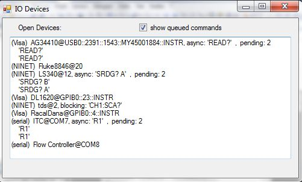
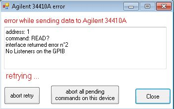

# IODevices
### Multithreaded communication for instrumentation interfaces: GPIB, Visa, Serial...

Synchronous/asynchronous control via multiple interfaces with command queuing

(C) Pawel Wzietek & Université Paris-Saclay 


Introduction
------------

This code and article have been first published in 2017 on the CodeProject website 
(https://www.codeproject.com/Articles/1166996/Multithreaded-communication-for-GPIB-Visa-Serial-i), the last revision published there was from May 2018.  Since the recent, apparently permanent, shutdown of the site I moved everything here. 
The licensing is derived from the original CPOL license: all the code is published under the open MIT license,
 however the author retains the copyright of the present article: you may not publish it elsewhere without permission by the author.

This project originated from my efforts to obtain efficient GPIB control in an environment where some devices are slow to respond and usually create a bottleneck in the data flow. The solution proposed in this software consists in using as much as possible the asynchronous operations where a different thread for each device is used so that the write/read operation sequences for different devices can be interleaved. This works quite well as I could easily obtain relatively high reading rates (e.g. an average of 2-3 reading/second/device for 10 devices i.e. a total of 20-30 operations/second) even in configurations where a few devices are very slow (e.g. 2-3 seconds response time). Asynchronous operations are queued which makes programming very simple. However standard synchronous (blocking) operations are allowed too, and the code can safely and transparently handle concurrent use of both synchronous and asynchronous commands.

As the software has been made sufficiently general to adapt it to various Gpib libraries it could eventually also be adapted to other interfaces such as the NI's Visa library and the serial port. Visa is especially interesting as it enables controlling devices via USB (for devices compliant with USB-TMC protocol) or TCP/IP (LXI standard) without need to develop specific drivers. Of course it would be great if someone could develop an implementation for these protocols not relying on Visa.

The software needs third-party drivers (except for the serial port) to be installed to operate.

Following the object-oriented philosophy, all interfaces are represented as classes derived from an abstract class representing a generic device, and the low-level interface-dependent operations are implemented as virtual methods so that the interfaces can be used "polymorphically" : except when instances of various devices are created, the code does not need to know which interface is being used for each of them. This approach also makes easy to add new interfaces or to tweak the provided implementations by creating child classes overriding methods that need to be modified.

The projects are written for WindowsForms applications and come in two versions: C# and VB.NET. In principle the two are equivalent and will create the  same binaries.

The code was originally created under VS2008 but have also been tested under recent versions of VS as well as SharpDevelop v4.3.


### Projects and files in the repository


##### Library code:

The projects `IODevices` and `IODevices_withNINET` construct a library (NET assembly "_IODevices.dll_") which defines a generic (abstract) class "`IODevice`" and its implementations (inherited classes) for various interfaces (see section "IODevices assembly and implementations" for more details on each of these classes and the required drivers). The interfaces are:

*   `GPIBDevice_NINET` - for NI boards, using the National Instruments' .NET assemblies
*   `GPIBDevice_ADLink` - for ADLink boards and other boards using *gpib32.dll*  (32 bit version only)
*   `GPIBDevice_gpib488` - for Keithley, MCC and older NI boards, via *gpib488.dll* (or *NI4882.dll*) 
*   `VisaDevice` - generic interface (GPIB, USB etc.) via Visa library, using *visa32.dll*
*   `SerialDevice` - for serial ports


Here the class `GPIBDevice_NINET` refers to the National Instruments' .NET assemblies to access the Gpib driver (see details in the class description, these are not included here because of copyright) and any project including this file will not compile without them.  However all other interface classes use Windows "dll"s only ("plain C" .dll files provided by various board vendors) so that any project using them will always compile whether or not the interfaces are installed on the system, if a necessary dll is not present an error will only occur if a corresponding class is instanciated. 

 Therefore I made two projects for two versions of the library:

*   project `IODevices`: creates the library without `GPIBDevice_NINET`
*   project `IODevices_withNINET`: including `GPIBDevice_NINET`

(The name of the resulting NET assembly is "_IODevices.dll_" for both, so it should be recompiled when switching from one version to the other).

Note that Gpib boards from NI can also be accessed via Visa interface which usually is also installed with them, so the `GPIBDevice_NINET` interface class may not be needed.


##### Test code:

The projects `testIODevice` and `testIODevice-withNINET` are demos showing how to use the basic functions of the library. You may choose two devices (eg. one fast and one slow) and see how it works sending commands to both at the same time.

The test projects contain a reference to the assembly "_IODevices.dll_" therefore both test and library projects are interdependent (it is practical to put them in the same "solution" if you want to examine how the code in the IODevices assembly works). Here these projects are contained in two solutions:

*   `testIODevice`
*   `testIODevice-withNINET`

each containing both a library and a test project.

##### Python bindings

The notebook _iodevclr.ipynb_ in the 'Python' directory shows how to call the library functions from Python, using the _PythonNET_ package. For me it worked well under Jupyter however I had some problems to import the latest version (as of 2025) of PythonNET under Spyder.  Apparently it is the line "clr.AddReference("System")" which causes the issue (this line is not absolutely necessary to use the library but it allows a better debugging capability through reflexion). The problem is solved disabling UMR, see https://github.com/spyder-ide/spyder/issues/21269.  


### Derivative work and third party implementations

I got quite a lot of feedback from people who have been succesfully using this code however I don't know how many of them have modified or extended it. One documented case is the app WinGPIB by Ian Johnston:

https://github.com/Ian-Johnston

This app uses a slightly modified and extended version of the library, you can find there some additional implementations (e.g. Prologix GPIB adapter).


Background: Gpib communication issues
-------------------------------------

NI references:

*   http://www.ni.com/white-paper/3275/en/
*   http://www.ni.com/tutorial/4054/en/
*   http://www.ni.com/white-paper/2927/en/
*   http://www.ni.com/tutorial/4478/en/
*   http://www.ni.com/white-paper/4629/en/

Let us examine a simple approach where Gpib devices are addressed sequentially:

*   send command to device 1
*   wait for response from device 1
*   send command to device 2
*   wait for response from device 2
*   send command to device 3
*   wait for response from device 3

This scheme has several potential shortcomings:

1.  if waiting for a response from device is achieved via low-level gpib functions then:

    *   the application freezes during wait if low-level gpib functions (“receive”) are called on the main (GUI) thread. 
    This problem can be solved using a different thread for gpib operations (asynchronous operations)
    *   the GPIB bus is locked during low-level interface calls therefore even using threading the sequence is not efficient because other devices have to wait too, unless we shorten as much as possible the “waiting for response” time inside “receive” functions, which are waiting for response with the gpib bus locked. 
     This can be achieved either using polling or setting very short timeout values and repeating reading on timeout, so that the bus is not locked most of the time.

2.  The sequential querying will take time which causes problem if we need to periodically scan many devices. The time needed to get the response is not only function of the size of data to transfer, usually the slowest response is expected for commands that trigger a measurement, such as the commonly used "Read" command of DMM's. For DMM's, the delay depends on the resolution of the measurement and getting a response can easily take a couple of seconds which is often the main source of bottleneck on the gpib. Of course there are software solutions using device specific configurations (trigger commands or auto-trigger mode if available etc.) however such an approach requires more programming effort and is more difficult to be made generic (typically an application has to handle a number of similar devices selected from a device pool each time a new experiment is configured). Therefore it is better if a generic yet efficient approach may be found.

Here, some issues are common to all interfaces but some others are more specific to gpib - in particular, the danger of locking the bus during relatively long periods of time is specific for gpib which, unlike Ethernet or USB, does not use a packet-switched protocol. GPIB communication works rather like an old telephone line : as long as the controller is listening for response from a device other devices cannot access the line.  Modern GPIB emulation protocols used by Visa (USBTMC over USB, VXI-11 and HISLIP over TCP/IP) don't have this issue, however these protocols still mimic the GPIB (programming model relying on blocking calls), therefore you need some efforts to make the communication fast and efficient.

Both the delays and the time intervals when gpib bus is unavailable can be minimized using (a) interleaving of command/response sequences and (b) polling. Command interleaving can be obtained automatically if each device has a dedicated thread for asynchronous operations, as explained below.

GPIB is a bus where the controller (PC) decides when each device is allowed to send data therefore the GPIB "write" and "read" operations can be interleaved, leading effectively to a parallel query of several devices at a time:

*   send command to device 1
*   send command to device 2
*   send command to device 3
*   wait for response from device 1
*   wait for response from device 2
*   wait for response from device 3

Here, at the time we receive a response from device 1, the devices 2 and 3 might be ready too to send data therefore there is no additional performance penalty due to devices 2 and 3.

The interleaving of the write/read sequences can be achieved automatically in a way totally transparent to the calling program if each device uses a different thread to perform gpib operations. Here is the scheme implementing this principle:

*   thread1: send command to device 1; wait for response from device 1
*   thread2: send command to device 2; wait for response from device 2
*   thread3: send command to device 3; wait for response from device 3

Here each thread will proceed as soon as the gpib bus is available. 

However, there remains the issue of the bus being blocked while waiting for a response from a device.
This is most efficiently solved using the "poll" feature of GPIB: test if a device is ready to send data before actually allow it to talk. So finally the most efficient scheme will be:

*   thread1: send command to device 1; periodically poll it for "data ready" status; get response from device 1
*   thread2: send command to device 2; periodically poll it for "data ready" status; get response from device 2

If a device does not support polling then it may be good to replace it by a constant delay (during which the respective thread is sent to sleep) between the write and read operations so as to shorten the "wait for response" time during which the bus is unavailable to other devices. Also, it is good to set a short timeout at the interface level and repeat reading after a delay if timeout occurs.

The purpose of this library implementing this scheme is to provide an out-of-the-box solution for creating such efficient code with minimum programming effort, all thread manipulating is transparent to the user code. Actually my own purpose was to easily adapt some existing applications that were using classical sequential approach with as few changes in the code as possible.

The `IODevice` class is intended to be adapted to any low level GPIB interface and therefore all low-level operations are defined as abstract (VB: MustInherit) methods. The project provides implementations (derived classes) of this abstract class for several GPIB interfaces (see file list above and reference below). Also, the abstract methods are sufficiently general to allow constructing implementations for other interfaces such as NI Visa and serial port (hence the initial name “GpibDevice” eventually became “IODevice”). It should be quite easy to create implementations for other hardware.

Note that the standard GPIB libraries also provide a sort of asynchronous operations, however somewhat limited, for example it is said in the NI reference manual :

> **Quote:**
> 
> "The asynchronous I/O calls (BeginRead and BeginWrite) are designed so that applications can perform other non-GPIB operations while the I/O is in progress. Once the asynchronous I/O has begun, further NI-488.2 calls are strictly limited. Any calls that interfere with the I/O in progress are not allowed and return an exception."

This means that no queuing is performed (and probably also that asynchronous operations on various devices are all executed on the same thread), anyway such limitation is not compatible with the parallel querying scheme described above (it also adds a lot of programming overhead compared to simple synchronous calls) and makes these features not very helpful for our purpose. Note that, on the other hand, the GPIB "Notify" callback feature does not suffer from such limitations and can be implemented resulting in a more powerful and more flexible asynchronous reading scheme, as explained later.

The code proposed here provides a somewhat higher abstraction level since asynchronous tasks are queued (see below) so that the calling program does not have to care about the moment a command is allowed to be sent: here all asynchronous calls are allowed at all times (but we can decide if a call is necessary inspecting the queue content with `PendingTasks` methods).

Note that queuing messages resulting from asynchronous write/read operations is possible in NI Visa (cf. `viWriteAsync`, `viReadAsync` functions). However, here the philosophy is different because the whole queries (write/read sequences, including commands) are queued for each device, so that the program does not have to wait until an asynchronous read operation completes before sending other commands to the same device\*. This makes the asynchronous programming extremely simple and allows an automatic “retry on error” feature. If the “retry” flag is set then, in case of error, the function will clear the device and repeat the whole write/read sequence until success or abort by user.

\*Actually I don’t have enough experience with Visa to tell if it can handle a query queue (but in all examples the program waits for write event before proceeding with read) so correct me if I am wrong. On the other some lower-level protocols like HiSLIP  implement query queuing.

**Polling**

quoted from: http://www.ni.com/tutorial/4054/en/ :

> "Serial polling is a method of obtaining specific information from GPIB devices when they request service. When you conduct a serial poll, the Controller queries each device looking for the one that asserted SRQ. The device responds to the poll by returning the value of its Status Byte. Device-dependent conditions, such as the presence of available data or an error condition, determine this value. ANSI/IEEE Standard 488.1-1987 specifies only one bit in the Status Byte, Bit 6, which is TRUE if the device requests service. The other bits in the Status Byte are left to the instrument manufacturer to define. IEEE 488.1-compatible instruments have bits that determine if an instrument error has occurred or if the device is conducting a self-test. These bit definitions are not consistent among instrument vendors and the method for determining the cause of a service request varies with each device.  
>   
> ANSI/IEEE Standard 488.2-1987 solves this problem by defining certain service request conditions so that one model describes the Status Byte for all compliant devices. Bit 6, the device Request Service (RQS) bit, maintains the IEEE 488.1 definition. If Bit 6 is set, then the device requested service. The IEEE 488.2 standard defines Bits 4 and 5; instrument manufacturers define the remaining bits (0 through 3 and 7). Bit 4 is the Message Available (MAV) bit. This bit is set if the device has been previously queried for data and the device has a pending data message to send.

First note that this explanation is misleading.  Polling and SRQ are two distinct features that can be used together but don’t have to:

> Serial polling is a method of obtaining specific information from GPIB devices when they request service.
 
Here polling is used to get the MAV bit whether SRQ is being used or not. 

> When you conduct a serial poll, the Controller queries each device looking for the one that asserted SRQ.
 
This is only true if you use the “autopolling” configuration (default setting for GPIB boards).  The problem with autopolling is that when an older device that does not support the standard SRQ-poll protocol is on the bus the autopoller can get stuck. Whenever possible I disabled autopolling and determine the source by my own way using board-level callbacks (see description of GPIBDevice_NINET and GPIBDevice_ADLink).  This was not possible in Visa therefore for some configurations handling SRQ may cause problems.    For more details on the use of SRQ see next section.


The polling option is enabled setting "enablepoll" field to true (default). It should be enabled if the device is compatible with the 488.2 standard. Then the serial poll is used to see if a device is ready to send data by examining its Status Byte, in this way the gpib bus is not locked most of the time when waiting for a device to respond. This is especially important when the query command also acts as a software trigger of a new measurement (standard behavior for DMMs).

This library only uses the MAV (Message Available) bit of the status byte defined in the standard as explained above. The position of the bit can be modified using the class parameter `MAVmask`.

Most devices comply to 488.2, but not all eg. some Lakeshore temperature controllers define their own meaning for all the status byte bits. If you see a "poll timeout" error appearing then it is probably the case and polling should be disabled. Alternatively, it is possible to write a derived class overriding the virtual method “`pollMAV`” : this method also returns the whole status byte so that it is easy to write a modified implementation where the status byte is interpreted differently (see example in the section about implementations).  If polling is not available then, as said above, we should set a short timeout at the interface level (the reading will anyway be repeated automatically on timeout) so to not to block the bus for long periods of time.

#### Asynchronous interface callbacks

In a scheme based solely on polling the effective response time of a device has a minimum granularity defined by the polling frequency.  For time-critical applications we can increase this frequency but this will also increase inefficient traffic on the bus (and may even cause errors if delays between subsequent polls are very short).  On the other hand, a low-level driver can have access to hardware interrupts and thus knows immediately about all signals appearing on the bus.  Various interfaces provide means of asynchronous signalling of events which can make polling more efficient.   In GPIB,  we can configure selected devices to pull the Service Request (SRQ) GPIB line when they are ready to send data and configure the driver to fire an asynchronous callback each time SRQ is detected.  The protocols USBTMC, VXI11 and HiSLIP also implement asynchronous service requests, using out-of-band signalling.  Likewise, the serial port can be configured to raise an event each time new data arrives.  For more info on how SRQ works see e.g.: https://www.tek.com/en/documents/application-note/how-program-instrument-assert-srq-gpib-bus

The IODevice class provides a very simple (optional) feature that can be used with asynchronous callbacks from the driver and which seamlessly integrates with the polling scheme described above:  the waiting for read after write or for next polling/reading trial can be asynchronously interrupted by another thread calling the device's method  `WakeUp`. Two delays are concerned: delay between write and read (`delayread`) and the delay between subsequent read/poll trials (`delayrereadontimeout`).  This method can be called from any thread and is intended to be used in a callback function called by a low-level driver (i.e. unsynchronized callbacks can be used).

In the current project version, this technique is implemented in all classes except GPIBDevice_gpib488 where the driver does not provide support for it: the classes GPIBDevice_NINET, GPIBDevice_ADLink and VisaDevice offer an optional possibility to set up the GPIB "Notify" callback or its equivalent in other protocols supported by Visa, and the class SerialDevice uses it by default, implementing a handler of the DataReceived event of the SerialPort class. 

Using the code : IODevice class reference
-----------------------------------------

### I/O functions

There are two types of I/O functions:

1.  `Send` functions are intended for commands where no response is expected from device
2.  `Query` functions write a command and read response

Both use the same code and architecture built around the `IOQuery` class (see below), in the code the term “query” is used for both (the “type” field in the `IOquery` class distinguishing between the two versions).

NB. There is no separate “read” operation as this would be incompatible with the “retry” feature (note that VISA defines three sorts of functions: write, query and read).

The "read" operation alone would only be required in the case of "talk only" devices, I don't know any but if such operation is needed, if a query method is called with command set to empty string then it will not call the “send” operation, it is therefore equivalent to a “read” alone.

The I/O functions don't throw any exceptions. External exceptions in the library functions or in the user callback functions can be catched or not (see `catchinterfaceexceptions` and `catchcallbackexceptions` flags). Note however that the class constructors can throw exceptions (this is to avoid creating ill-defined objects, catching constructor exceptions should be done outside the constructor), see descriptions of different classes below.

Each type of command is provided in two versions (see reference below for the syntax of each command):

1.  blocking commands: `SendBlocking`, `QueryBlocking` are immediately executed on the calling thread (usually GUI thread), the method waits until it gets response from the interface.

Here “blocking” means that the call will not return until the response is received, however the bus is not blocked during the whole query therefore other queries can be conducted in parallel, exactly as for “async” commands. Of course for each device only one blocking command is allowed at a time.

2.  asynchronous commands: `SendAsync`, `QueryAsync` : here queries are queued and the queue is processed on a different thread (producer-consumer model). The call appends the query to the queue and returns immediately. When the query is completed the user "callback" function is called.

Each device has its own queue and runs its own dedicated thread processing queries from the queue. In this manner the asynchronous commands to a device are processed sequentially but commands to different devices can be processed in parallel, as explained above.

The idea of using both types of queries is that often the mainstream sequence (eg. needing complex sequence for device configuration, arming, acquiring etc., where the commands to sent may sometimes depend on the data received so it is simpler and natural to use synchronous calls) runs in parallel with some annex tasks repeated at constant intervals to update the status of the experiment (e.g. reading temperature every second). For these tasks we usually use timers, and such tasks are much more efficient with asynchronous queries, using available bus bandwidth and time slots.

Even without timers, there is a benefit in using the asynchronous commands to initiate simultaneous queries. Then the method, "WaitAsync" can be used for synchronization between the asynchronous command queue and the main thread: this method waits until queries initiated before the call are completed (N.B. not until the queue is empty - this may never happen if other asynchronous queries are also issued in timers). For example:

```
device1.QueryAsync(...);
device2.QueryAsync(...);
device1.WaitAsync();
device2.WaitAsync();
```
As explained in the introduction, this sequence will in general perform better than an equivalent sequence of two blocking queries.

It is perfectly legal to call another asynchronous query from within a callback function. This offers a possibility to chain asynchronous operations (and a circular chain will generate a loop of asynchronous operations). Suppose you need to implement a sequence where after device 1 is queried, its query result is used to select/format another query on device 2. This whole sequence can be implemented asynchronously if the query on the second device will be called from the callback function handling the query of device 1. Such an approach based on chaining asynchronous tasks via callbacks bears some resemblance to the way Labview works: in Labview, the program flow control (scheduling of different tasks such as reading instruments and processing) is entirely based on the data flow e.g., a data received from an instrument is used as an event trigger for the next node of the code diagram.


One can mix blocking and asynchronous commands even on the same device, then a blocking command should in principle be processed as soon as the current asynchronous operation (if any) completes or when it is waiting for retry (however there is no guarantee as for the exact timing which is decided by the OS task scheduler).


#### Common arguments:

*   `string cmd`: command string
*   `bool retry`: if set to true the whole query will be repeated on error (until success or abort by user)
*   `bool cbwait`: if set to true the async thread will wait until the callback function completes before processing remaining queries in the queue (this is the default behavior for short versions where this argument is absent). May be set to false eg. if a callback function starts a long processing and there is no need to wait, however in this case the callback function has either to block event processing or to be reentrant (can be called again before it returns). Note also that with this setting the class' "catching callback exceptions" feature (`catchcallbackexceptions` flag set to true) will not work, this is related to the way the synchronization context works in NET. 
*   `int tag`: an additional field passed on to the query variable, may be used to distinguish between queries if the same callback function is used to process different queries.

#### Blocking commands : `SendBlocking` and `QueryBlocking`

 `SendBlocking`:

C#
```C#
public int SendBlocking(string cmd, bool retry)
```

VB
```vb
Public Function SendBlocking(ByVal cmd As String, ByVal retry As Boolean) As Integer
```

 `QueryBlocking`:

C#

```C#
public int QueryBlocking(string cmd, out IOQuery q, bool retry)  

public int QueryBlocking(string cmd, out string resp, bool retry)

public int QueryBlocking(string cmd, out byte[] resparr, bool retry)
```
VB

```vb
Public Function QueryBlocking(ByVal cmd As String, ByRef q As IOQuery, ByVal retry As Boolean) As Integer

Public Function QueryBlocking(ByVal cmd As String, ByRef resp As String, ByVal retry As Boolean) As Integer

Public Function QueryBlocking(ByVal cmd As String, ByRef resparr As Byte(), ByVal retry As Boolean) As Integer
```

In the first syntax the variable `q` (see below for the definition of the `IOuery` class) contains the full information on the query (status,data, timings), the other two are simpler versions giving directly the result either as a string (`resp`) or a byte array (`resparr`). In case of error (return value different from 0) `q` will contain the error code and message, however the data fields (`ResponseAsString`, `ResponseAsByteArray`) will be null references (VB: Nothing), as well as the corresponding variables `resp` and `resparr` in the two other versions.

Return value: same as `q.status` (0 if ok or error code), otherwise -1 if blocking call on this device is already in progress (may happen if events allowed), -2 if device is disposing.

#### Asynchronous commands: `SendAsync` and `QueryAsync`

Most of these methods use an argument of type `IOCallback` to define the callback function. The signature of this function is given by the declaration:

C#:
```C#
    public delegate void IOCallback(IOQuery q);
```
VB 
```C#
Public Delegate Sub IOCallback(ByVal q As IOQuery)
```

Here the variable `q` will contain the status and data relative to the operation, the rules are the same as for the blocking calls i.e. the data fields are null references if an error occurred.


Note that, even though the callback is initiated from a different thread, the callback function will be executed on the main (GUI) thread (this is to allow updating GUI components within the callback function), in other words the asynchronous thread sends a message to the main thread to call the function. Therefore the callback function will not be called until processing messages by the GUI thread is allowed.


##### SendAsync

C#
```C#
public int SendAsync(string cmd, bool retry)

// complete version (with callback)

public int SendAsync(string cmd, IOCallback callback, bool retry, bool cbwait, int tag)
```
VB
```vb
Public Function SendAsync(ByVal cmd As String, ByVal retry As Boolean)

  ' complete version (with callback)

Public Function SendAsync(ByVal cmd As String, ByVal callback As IOCallback, ByVal retry As Boolean, ByVal cbwait As Boolean, ByVal tag As Integer) As Integer
```
The return value for all versions of `SendAsync` is: 0 if ok, -1 if the queue is full (for each device the maximum queue length is defined by the field `maxtasks`, default is 50), -2 if device is disposing.

The standard version does not use a callback: it is a "fire-and-forget" version. In the complete version (probably rarely needed though) the callback function will be called to signal the status of the operation (however there will be no valid data in the `IOquery` variable passed to it). This version enables however the calling program to break the “retry” loop calling the `AbortRetry` method of the `IOQuery` variable.

##### QueryAsync with callback

When the function completes (or when there is an error) it will call the callback function passing the result in a `IOQuery` variable. The callback function has to check the status field of the received `IOQuery` variable to check if there is a valid data there (if status is not 0 then `ResponseAsString` and `ResponseAsByteArray` will be null references).

C#

```C#
//standard:

        public int QueryAsync(string cmd, IOCallback callback, bool retry)

//complete:

      public int QueryAsync(string cmd, IOCallback callback, bool retry, bool cbwait, int tag)

```
VB

```VB
'standard:

Public Function QueryAsync(ByVal cmd As String, ByVal callback As IOCallback, ByVal retry As Boolean) As Integer

'complete:

Public Function QueryAsync(ByVal cmd As String, ByVal callback As IOCallback, ByVal retry As Boolean, ByVal cbwait As Boolean, ByVal tag As Integer) As Integer

```

##### QueryAsync with TextBox

This is a "light" version where, instead of calling a callback function, the result is put (if no error occurs) in a `TextBox` variable (its `Text` property). This version does not return any error information (except in the message window, if enabled).

C#
```C#
//2nd version : update textbox with data string

   public int QueryAsync(string cmd, TextBox text, bool retry)

  public int QueryAsync(string cmd, TextBox text, bool retry, int tag)
```

VB
```vb
   ' 2nd version : update textbox with data string

Public Function QueryAsync(ByVal cmd As String, ByVal text As TextBox, ByVal retry As Boolean) As Integer

Public Function QueryAsync(ByVal cmd As String, ByVal text As TextBox, ByVal retry As Boolean, ByVal tag As Integer) As Integer
```

The return value for all versions of `QueryAsync` is: 0 if ok, -1 if the queue is full (for each device the maximum queue length is defined by the field `maxtasks`, default is 50), -2 if device is disposing.

#### The class `IOQuery`  

This class has been defined to assemble all information returned following a query,  it contains the following public members:


C#

```C#
public string cmd;  // copy of the command to identify query

public int tag;  //optional additional query identifier

public string ResponseAsString; // non null only if status=0

public byte[]  ResponseAsByteArray; // non null only if status=0

public int status;

 //0:ok, otherwise combination:

 //bit 1:timeout, bit 2: on send(0) or recv(1), bit 3 : other error (see errcode), , bit 4: aborted by user, bit 5: poll error, bit 8: error in callback (exceptions catched when "catchcallbackexceptions" flag is set)

 // so if not aborted: status=1: tmo on send; =3 tmo on rcv, =4 other err on send, =6 other err on rcv; if aborted add 8 , if  poll timeout add 16,

 public int errcode; //interface error code (valid if status>0)

 public string errmsg; //interface error message(valid if status>0)

 //additional fields for testing performance:

 public DateTime timecall; // when method called

 public DateTime timestart; //when device unlocked and operation started

 public DateTime timeend; // when data received (or aborted)

 public int type;          //type of query: 1 ("send", no resp.), 2: true "query" (wait for response)

 public IODevice device ; // device used (to access other fields)

 public void AbortRetry(); //abort this task (async or blocking)

 public void AbortAll();  // calls device.AbortAllTasks

```

VB (see C# code comments above)

```VB
Public cmd As String

Public tag As Integer    

Public ReadOnly Property ResponseAsString() As String

Public ReadOnly Property ResponseAsByteArray() As Byte()

Public status As Integer

Public errcode As Integer 

Public errmsg As String    

Public timecall As DateTime

Public timestart As DateTime 

Public timeend As DateTime

Public type As Integer   

Public ReadOnly Property device() As IODevice

Public Sub AbortRetry()

```

#### Other methods and fields of IODevice class

##### Instance public methods:

C#

```C#
public bool IsBlocking();          // true when blocking call in progress

public int PendingTasks();         //  return number of queries in the queue

public int PendingTasks(string  cmd); //  same for a specific command: number of copies of specific command in the queue

public int PendingTasks(int tag)      // same for commands with a specific tag value

public void WaitAsync();  //this method can be used to synchronize blocking and async calls

public void AbortAllTasks();    //as in the title: aborts all queries (current blocking or async, and queued tasks)

public void Dispose();
```
VB (see C# code comments above)

```vb
Public Function IsBlocking() As Boolean

Public Function PendingTasks() As Integer

Public Function PendingTasks(ByVal cmd As String) As Integer

Public Function PendingTasks(ByVal tag As Integer) As Integer

Public Sub WaitAsync()           
 
Public Sub AbortAllTasks()

Public Sub Dispose()

```

##### Static (VB: "shared") methods

C#
```C#
public static void ShowDevices() //shows DevicesForm displaying current status of all devices, see below.

public static IODevice DeviceByName(string name) // find device among created devices using name

public static void DisposeAll() // dispose all created devices
```
VB
```vb
Public Shared Sub ShowDevices()

Public Shared Function DeviceByName(ByVal name As String) As IODevice

Public Shared Sub DisposeAll()
```

##### Instance public fields :

C#
```C#
public int maxtasks;  //max queue length (default=50)

public string devname, devaddr;          //device name and address

public static string statusmsg;   //optional message (status etc.) to display in device list window

 // some delays to tweak performance (all in ms):

public int delayread; //default delay between cmd and read : to avoid blocking gpib bus by slow devices when polling is not available

public int delayrereadontimeout;      //default delay before retrying read after timeout or delay between polls if polling used

public int delayop; //delay to wait between operations, for old devices that may not accept frequent requests

public int readtimeout;          //cumulative timeout for read

public int delayretry; //delay before retry on timeout

public bool checkEOI;         //use EOI information: if true repeat read if EOI not detected (eg. buffer too small); default=true,

public bool enablepoll; //use serial poll, set to false for devices not  supporting polling ("poll timeout" message)

public byte MAVmask = 16;   // for GPIB, USBTMC-USB488, VXI-11:
                           // standard (488.2) mask for MAV status (bit 5 of the status byte),
                           // change it for devices not quite compliant with 488.2

public bool stripcrlf;         //remove crlf in ByteArrayToString method

public bool eventsallowed; //for blocking commands : when waiting for response and during and retry loop

public bool showmessages;         // showing error window IOmsg enabled

public volatile IOQuery lastasyncquery;

public bool catchinterfaceexceptions;         //default=true , set to false when debugging a new interface

public bool catchcallbackexceptions;          //default=true

public bool callbackonretry;         //default=true, if callback called on each retry when error
```

The internal methods and properties to use in implementations are listed in the section "Writing Implementations".

### Devices list window

opens when calling the static method `IODevices.ShowDevices()`, looks like this example:



By default `ShowDevices()`, will be called at startup (in the static constructor of `IODevices`), if you find it annoying you can set the constant `showdevicesonstartup` to false. 

### Error message window



When `showmessages` field is set to true (default) this forms opens when an error occurs. The form is not modal and is for information only: the program continues the same way whether the form is displayed or not. However it allows you to easily abort a "retry". When an error is corrected after a successful retry then the form will close itself. In the example above it signals that a device is not connected and that the query will be repeated, once it is connected the message will disappear. If you close the window and the error persists then the message will pupup again, minimize the window instead of closing it if you find it annoying. 

Note that all the information displayed in this window is also contained in the `IOQuery` variable (except, obviously, for callback exceptions), it is therefore easy to implement your own messaging.


## IODevices assembly and implementations

The assembly defines two namespaces: `IODevices` and `IODeviceForms`. The latter is used internally to access forms displaying the device list and error messages and does not need to be imported in the application.

The `IODevices` namespace which should be imported to the application defines the following classes:

#### class IOQuery

as explained above

#### class IODevice

Is an abstract (VB: `MustInherit`) class from which various kinds of real devices are derived as child classes. Contains the main code and public methods but refers to four abstract methods to address the low level interface (see explanation in the code under “abstract methods” comment if you want to implement other interfaces).

Following the object-oriented philosophy every device derives from `IODevice` which contains all public methods, whereas the low level interface is accessed via private virtual methods, in this way the child classes can be used polymorphically: except when the instance of a device is created the code does not need to know which interface is used (see sample code in the `testIODevice` project).

The implementations of this abstract class given here provide a basic configuration (but succesfully tested with various devices). Again following the object-oriented philosophy, it is easier to write a derived class for each specific configuration than to make a class which would take into account all available options. For example, all GPIB classes use the standard "EOI" signal to detect the end of message. If your device cannot set EOI but instead uses a specific caracter to terminate messages (e.g."\\n") you can write a child class which redefines the constructor to set the device options accordingly (alternatively, it may also override the `ReceiveByteArray` method, see section about writing new implementations).

The constructor of each implementation class will throw an exception if the device initialization fails. This is to prevent creating ill-defined objects, catching constructor exceptions should be done outside the constructor.


##### *enabling asynchronous Notify callbacks for GPIB and Visa:*

The class IODevice defines a virtual boolean property EnableNotify (default=false) so that it can be implemented where needed and allowing writing a generic code. In the default base-class implementation trying to set this property to true will raise a NotSupportedException.  In the current version, the property is implemented (overridden) in the implementations GPIBDevice_NINET, GPIBDevice_ADLink and VisaDevice, in these classes setting this property to true will enable the board's "Notify" callback to be activated on SRQ and subscribe to the notify event for the device. Each callback on SRQ will then call the device's WakeUp() method as explained before.

To enable setting SRQ when the MAV bit is set, you need to enable the appropriate bit in the Service Request Enable Register of your instrument. Usually, it is the bit 4 and it will be set sending the command "*SRE 16" to the device (note that you can also add other flags to wakeup on, eg. OPC, error, etc.). There is an example of function doing all these configuration steps in the test Form:

```C#
public void setnotify(IODevice dev)
  {
   try{  //use try-catch in case it is not implemented in the actual target class

          dev.EnableNotify = true;                  //enable calling WakeUp on SRQ


          if (dev.SendBlocking("*SRE 16",true)==0) // set bit 4 in Service Request Enable Register,
                                                  // so that the MAV status will set SRQ
                                      //(more generally, if not 488.2 compatible: send the MAVmask) 
          {

          dev.delayread = 1000;
          dev.delayrereadontimeout = 1000;          //set long wait delays :
                                                    //will be interrupted anyway
          }
      }
   catch (Exception ex)
            {
        MessageBox.Show( "cannot set EnableNotify for device " +
                                 dev.devname + CrLf + ex.Message);
      }
  }
```


#####  *readtimeout field vs. interface timeout setting considerations:*

The low-level drivers have a "timeout" parameter which defines the maximum amount of time the driver will wait for an operation to be completed, otherwise, it will abort it. For the "receive" operation this time includes both the waiting for the device to be ready and the time needed to transfer the data. If polling is used (`enablepoll`=true) then the "receive" operation is never called before the device is ready, therefore the timeout should only be greater then the data transfer time but the exact setting is not critical (the default value of 3s should be ok for most cases). However, for devices where polling is not available and is disabled, it may be necessary to tune the interface timeout so that the "receive" operation does not block the interface for a long time. When the interface timeout is signalled, the IODevice class will automatically repeat the reading (the definitive timeout condition is signalled only when the cumulative timeout delay `readtimeout` elapses, see query sequence) so that the interface timeout can be set relatively short (but long enough compared to the expected data transfer time to not to risk interrupting the transfer). For example, if we need to wait about 1s to read a short string (data transfer time below 100 microseconds), we can safely set, e.g., `delayread`=1000 and the interface timeout to 100-300ms.

The method to set the interface timeout for GPIB/Visa is implementation dependent (via properties `NIDevice`, `IOTimeoutCode`, `IOTimeout`, depending on the subclass).
There is no need for such property in the SerialDevice implementation because the interface timeout has a very different meaning here: for a serial port the "receive" operation does not really involve a data transfer (receiving is handled by the driver continuously in the background and a call to the driver function only invokes a memory copy from an internal input buffer). Therefore, the serial port driver timeout can be fixed to an arbitrarily short value without risk of data corruption.

##### *checkEOI flag and buffersize:*

For all GPIB classes, if the `buffersize` constructor parameter is not specified in the constructor, it will be set to 32k by default (the implementations also provide a property `Buffersize`).

Buffersize determines the maximum amount of data (in bytes) that can be read in a single call to a library "receive" function.
By default, GPIB uses the signal "EOI" set with the last transferred data byte to tell the receiver that all data has been read: if EOI is not set, it means that all data could not be transferred, most often because it could not fit within the provided buffer size, and that reading should be repeated to get the next part of it. If the field `checkEOI` is set to true (default), then each time EOI is not set after a read, the class will automatically repeat reading and append the data to the input buffer. Of course, reading in small chunks will incur a big performance penalty (the device has to be readdressed each time), so it is in general better to set the buffer to the maximum expected data length*. Maybe, in cases when a very big amount of data is to be read, one could prefer to limit the buffer size so as to split readings in several parts in order to free the bus in between, so to make it more often available for other devices.

*apparently, it can also happen that a bugged device firmware exhibits an undefined behavior when the receiving buffer is too small.


### *Implementations*

Below is the list of the implementations provided here (other implementations, mostly written by EEVblog members, can be found on Ian-Johnston's website/github). 

#### class GPIBDevice_NINET

This class uses the native .NET library for NI Gpib , uses as reference the following .NET assemblies from NI: `NationalInstrumentsCommon`, `NationalInstruments.NI4882` (these are installed with the NI GPIB driver). The class was intensively tested with the GPIB-USB-HS+ board from NI (running 24/7 for months). The assembly will not compile if these files are not found (and were not included here because of copyright), therefore a version of the project where this class is not included is also provided. Note that in many cases we won't necessary need this library: usually the NI software for GPIB will also install Visa. Also, in the 32bit environment the ADLink implementation is in principle compatible with the dll provided by NI (see later).

class constructors:

C#
```C#
public GPIBDevice_NINET(string name, string addr)

public GPIBDevice_NINET(string name, string addr, int buffersize)
```
VB 
```vb
Sub New(ByVal name As String, ByVal addr As String)

Sub New(ByVal name As String, ByVal addr As String, ByVal buffersize As Integer)
```
name is the name given to the device and displayed in the DevicesForm.

addr is the GPIB address and can have the following forms:

"n"        device n at board n°0   e.g.  "1"

"b:n"     device n at board n° b   e.g.  "0:1"

"GPIBb::n::INSTR"   (Visa format)  device n at board n° b   e.g.  "GPIB0::1::INSTR"

The class implements the virtual boolean property `EnableNotify` (default=false).   Setting this property to true will enable the board's *Notify* callback to be activated on SRQ and subscribe to the notify event for the device.  Each callback on SRQ will then call the device's `WakeUp()` method as was already explained earlier.  

The NI library provides two versions of the callback: at board level (only one callback function can be defined for a board) and at device level (per-device callback functions).  For the latter, as there is only a single SRQ line, the NI driver will, by default, automatically poll the connected devices to find the source of SRQ. This is the standard use of SRQ as explained in the GPIB manuals. 


However, in early releases I noticed that the Notify feature was sometimes not working properly, depending on the hardware configuration. I found since that the problems were precisely related to the behavior of the NI driver's automatic polling feature (activated by default) which apparently tries to poll all devices present on the bus, whether or not they subscribed to device-level callbacks: if one device does not reacts correctly to a SRQ/poll the driver gets stuck. (BTW. the autopolling feature has to be used with caution, see e.g., http://www.ni.com/pdf/manuals/321819e.pdf, section 7.13). In this code, the autopolling has been disabled (in the static class constructor), in this way, Notify will work well even in configurations where SRQ-enabled instruments share the bus with devices which are not poll-aware and would be expected to impair the operation of the autopoller.


Instead, the class only uses the board-level callback and therefore does not need the autopolling to be enabled, this is because calling Wakeup will proceed to poll anyway (if polling is enabled, however note that you can use this feature even with polling disabled: then calling `Wakeup` will result in trying to read data immediately).  The class keeps a list of all devices for which EnableNotify was set, then each SRQ request will call WakeUp methods of all devices having subscribed but not the others, so that devices that cause trouble to SRQ can be easily excluded from the procedure. Note that if SRQ is used for many devices on the same board it may become less efficient (and more prone to driver errors).  Typically, it should be used for selected devices for which it is essential to get data as soon as it is ready.  


#### class GPIBDevice_gpib488

uses the Windows dll library "_gpib488.dll_" provided with Measurement&Computing or Keithley boards and also some older NI boards. This dll is usually provided in both 32bit and 64bit versions (with the same name but in different Windows directories). The class has been tested with the KUSB-488A board from Keithley. I don't have a MCC board but the signatures of all the _gpib488.dll_ functions are exactly the same for both (let me know if there are problems). For older NI boards there is an equivalent library named "_NI4882.dll_" that I have tested too, it works in principle but seems a bit flaky with some devices (using Visa is apparently more reliable here). The name of the dll is defined by the string constant `_GPIBDll` so it is easy to change it in the code. Note that for NI I noticed that many provided GPIB examples for C/C++ programming use rather Visa interface instead of these older dlls so this is probably the way to go if you don't want to use the NINET interface. 

The constructor parameters are the same as for GPIBDevice_NINET.

The Notify feature is not available in this library therefore EnableNotify is not implemented here.

The class adds a property:
```C#
public int IOTimeoutCode
```
which sets/gets the interface timeout for the device (codes defined in the DLL manual are reported in the class as constants).


#### class GPIBDevice_ADLink

uses the Windows dll  "_gpib-32.dll_" provided with ADLink boards. Was intensively tested with the USB-GPIB3488A board from ADLink (running 24/7 for months).

NB. this dll has the same name as the one installed by NI software or older MCC software. It may be wiser to rename this dll before installing it in the Windows directory (Windows/SysWow64 on 64 bit systems) and then change the string constant “_GPIBDll” in the code.

The constructor parameters are the same as for GPIBDevice_NINET.

The class adds a property `IOTimeoutCode` working like the one of GPIBDevice_gpib488.

The class implements the property `EnableNotify`. It has been implemented in a way similar to GPIBDevice_NINET: only the board callback is used and autopolling is disabled, the class maintaining a list of subscribers to the Notify service (see description of GPIBDevice_NINET for more details).

In the first version the class was using the driver calls provided in the ADLink library import module for C#. These are not all compatible with the "standard" calls found in other "gpib-32" dlls, however all standard routines exist there as can be found using a dll browser.  In the current version only standard calls are used.  Therefore this class is also compatible with NI drivers  (so the class could rather be called "GPIBDevice\_gpib-32" but I did not want to change the name). Note however that error messages are less complete here than those returned by GPIBDevice_NINET. The code of this class is almost identical to the one of GPIBDevice_gpib488  except for some tiny differences in the driver functions signatures.  

Note for ADLink board users:

The C# interface class provided by ADLink has a bug (that I had initially reproduced in both C# and VB versions) resulting from an incorrect transcription of the original C header specifying the DLL functions signatures (the type "long" is usually an Int32 in C, but in C# "long" means Int64). Luckily, this bug was not harmful for the data passed to the DLL and it could even go unnoticed in NET Framework ver. 3.5 (VS2008) because the interop marshaller fixes the stack (https://msdn.microsoft.com/en-us/library/ff361650(v=VS.100).aspx), however under NET 4.0 and higher (VS2010 and later), the default marshaller is more strict and the bug would trigger a 'PInvokeStackImbalance' error.  I have corrected the bug since and the present version works correctly under recent NET versions.


#### class VisaDevice

Uses Windows dll “_Visa32.dll_”. It is provided in both 32bit and 64bit versions (with the same name, to force using the 64 bit version “_Visa64.dll_” you may change the constant “_VisaDll” in the code).

NB. In 32bit Windows dlls are in Windows/system32 but in 64bit Windows, 32bit dlls are in Windows/SysWow64 and 64bit dlls are in Windows/system32.

National Instruments' Visa library provides a generic interface that can be used to access various physical interfaces (Gpib, serial, USB, TCP/IP, etc.). There is an equivalent library by Keysight (formerly Agilent), in principle, both NI and Keysight versions are binary compatible (both may be downloaded from their respective websites). 
Visa implements various protocols developed for instrumentation like  USBTMC (over USB),  VXI-11 and HiSLIP (over TCP/IP).  These protocols mimic the behavior of GPIB in many aspects as they were intended to replace it. We find there the equivalents of polling the status register, out-of-band signalling for service request messages etc.   The VXI-11 and HiSLIP protocols are part of the LXI standard (Lan eXtension for Instrumentation, which defines protocols for controlling instruments via TCP/IP). 

In principle the basic read/write functions are the same for all interfaces handled by Visa however each of them may need a specific configuration (options – called “attributes” in Visa, error handling etc.). The `VisaDevice` class provides a basic Visa configuration, you may need to create derived classes to tweak it for a specific configuration. It was successfully tested with GPIB (using GPIB-USB-HS+ board from NI),  USB and TCP/IP.  For GPIB, a small advantage of VisaDevice over the GPIBDevice\_NINET class is that it does not require any external assemblies from NI (the needed version of these may depend on the compiler, .NET version etc.).

The "Notify" feature is implemented in this class.  The class' property `EnableNotify` works exactly like in the `GPIBDevice_NINET` class.

`VisaDevice` can be used for GPIB with NI drivers (then you don't need to install the NI Net assemblies), then there are small differences compared to `GPIBDevice_NINET` :

*    NINET allows to create a device even if it is not connected to the system while in Visa this will cause an error (actually the error occurs when trying to clear the device on startup, this may be disabled in the code setting the constant `clearonstartup` in `VisaDevice` to false)
*   in VisaDevice only a few common errors give full-text messages, for other errors only the hexadecimal error code is reported (I was just too lazy to code all possible messages)
*   Visa only provides device-level callbacks, for NI GPIB these rely on "autopolling", therefore for some hardware configuration `EnableNotify` may encounter problems that I previously had with  `GPIBDevice_NINET` (see the GPIBDevice_NINET class description above).

For USB, the device has to be compatible with the "Test and Measurement Class" (USB-TMC) protocol. When after connecting it the device is detected as a "Test and Measurement Device" then it can be used immediately. If the driver is not present then see [http://www.ni.com/tutorial/4478/en/](http://www.ni.com/tutorial/4478/en/) for instructions to create one.

For VXI-11 and HiSLIP it may be convenient to use NI MAX utility to setup the LAN parameters.

The constructor parameters are the same as for `GPIBDevice_NINET`. However, here the format for the address parameter must be compatible with Visa specifications:

for Gpib:   GPIB\[board\]::address::INSTR

for USB:    USB\[board\]::manufacturer ID::model code::serial number::INSTR

for TCPIP:  TCPIP\[board\]::IP address\[::LAN device name\]::INSTR


This class also adds methods to set and get Visa attributes (here limited to most common attribute types: int, uint) as well as a property to get/set the interface timeout for the device:

C#
```C#
public uint SetAttribute(uint attribute, int attrState)
public uint SetAttribute(uint attribute, uint attrState)

public uint GetAttribute(uint attribute, out int attrState)
public uint GetAttribute(uint attribute, out uint attrState)

public int IOTimeout  //timeout in ms
```

VB.NET
```vb
Public Function SetAttribute(ByVal attribute As UInteger, ByVal attrState As Integer) As UInteger
Public Function SetAttribute(ByVal attribute As UInteger,  ByVal attrState As UInteger) As UInteger

Public Function GetAttribute(ByVal attribute As UInteger,  ByRef attrState As Integer) As UInteger
Public Function GetAttribute(ByVal attribute As UInteger, ByRef attrState As UInteger) As UInteger

Public Property IOTimeout() As UInteger 
```

#### class SerialDevice

Although Visa can be used to access serial ports it was simple (also more useful and efficient since it does not need Visa resources) to write an implementation using the standard SerialPort class provided in NET.

constructors:

C#
```C#
public SerialDevice(string name, string addr)
```
public SerialDevice(string name, string addr, string termstr, int buffersize)

VB
```vb
Sub New(ByVal name As String, ByVal addr As String)

Sub New(ByVal name As String, ByVal addr As String, ByVal termstr As String, ByVal buffersize As Integer)
```

parameters:

termstr defines the "NewLine" string

address format:

COMport,baud,parity,databits,stopbits \[,_newline_\]

newline can be CR ("\\r"), LF ("\\n") or CRLF ("\\r\\n") (for other values use the second version of the constructor).

for example:

"COM1:9600,N,8,1,CRLF"

if "termstr" is defined in the constructor then it will take over the value set in "addr".

There is no polling feature for serial port, therefore for this interface 1) the polling function sets the MAV status to true as soon as the input buffer is not empty; 2) then the serial port timeout is set to very short value (few ms) so that blocking commands do not freeze GUI when waiting for a line to be completed (here reading will almost always be repeated more than once).

Like for the classes `GPIBDevice_NINET` and `VisaDevice`, the current version uses an asynchronous signalling, here the property controlling it is `EnableDataReceivedEvent` and is set to true by default in the class constructor.   When enabled it defines a handler for the SerialPort class' DataReceivedEvent, the handler calls `WakeUp()` to immediately interrupt any waiting delay.  Note that this event it is different from *Notify* in GPIB and Visa: the event is not to signal that the data is ready, it rather occurs whenever a new data packet arrives to the port (however, the .NET SerialPort class does not guarantee it will be called on each character therefore default delays are set short in case the end-of-line character is missed). Unlike GPIB where all devices share a single SRQ line, each serial port has its own handler, therefore it does not need to make lots of unnecessary polls to determine the source of the event.


With this feature the `SerialDevice` class will provide response as soon as it is completed, in both blocking and asynchronous queries.   In principle there is no reason to disable this default behavior - maybe except when you are expecting an extremely long response and want to avoid events to be fired every few incoming characters or so.  

Note that unlike protocols like GPIB, USBTMC or LXI which are defined to make things uniform, the serial port does not have any standard protocol for messages therefore it is not possible to make a plug-and-play class (like Visa) working for all serial connections.  The `SerialDevice` class implements a simple line-oriented protocol: each message terminates with the same special end-of-line character and there is one response message for each query. However if your device uses something different  -  such as either fixed length messages with no termination or some weird syntax where both terminated and fixed-length messages are mixed or where responses can use different termination characters depending on command - then it will be necessary to make a derived class overriding the method `ReadByteArray`.  In case this method needs to know what the command sent was to determine how to format the response, I have added a property `currentactivequery` which may be used to access this information.

I have tested the class with a Prolific USB-serial converter (with four com ports).
If you have problems when using more than one port at the same time, then it might have something to do with the virtual port driver and threading, read "query sequence and lock levels" in the last section.


## Writing implementations

It is easy to create derived classes to create new implementations or to tweak existing implementations for a specific configuration. There are four abstract methods to define (override):

C#
```C#
protected abstract int ClearDevice(ref int errcode, ref string errmsg);

protected abstract int Send(string cmd, ref int errcode, ref string errmsg);

protected abstract int PollMAV(ref bool mav, ref byte statusbyte, ref int errcode, ref string errmsg);

protected abstract int ReceiveByteArray(ref byte\[\] arr, ref bool EOI, ref int errcode, ref string errmsg);

protected abstract void DisposeDevice();
```

VB
```vb
Protected MustOverride Function ClearDevice(ByRef errcode As Integer, ByRef errmsg As String) As Integer

Protected MustOverride Function Send(ByVal cmd As String, ByRef errcode As Integer, ByRef errmsg As String) As Integer

Protected MustOverride Function PollMAV(ByRef mav As Boolean, ByRef statusbyte As Byte, ByRef errcode As Integer, ByRef errmsg As String) As Integer 'poll for status, return MAV bit

Protected MustOverride Function ReceiveByteArray(ByRef arr As Byte(), ByRef EOI As Boolean, ByRef errcode As Integer, ByRef errmsg As String) As Integer

Protected MustOverride Sub DisposeDevice()
```
See explanations in the code of the class `IODevice`  under the comment "interface abstract methods that have to be defined" for the meaning of parameters and return values.


Example: If your device does not comply with the 488.2 standard on the meaning of the status byte bits, in the simplest case, you only need change the class' variable MAVmask (default=16 for the MAV status in bit n°4), if however, the status is coded in a more complicated way, then you may need to re-interpret this byte to get the "message available" status, something like this:

```C#
protected override int PollMAV(ref bool mav, ref byte statusbyte, ref int errcode, ref string errmsg){

// in the base class the mav status is obtained by bitwise AND between status byte and MAVmask
int pollresult = base.PollMAV(ref mav, ref statusbyte, ref errcode, ref errmsg);

//but we can reinterpret the received statusbyte in a different way :
if (pollresult == 0) { mav = ...;} 

return pollresult;

}
```
The class IODevice also provides several protected methods and properties to use in implementations:

C# 
```C#
protected void AddToList(); //register device in "devicelist" shown in DeviceForm, this should only be called by child class constructors (is not called in the base class constructor to avoid registering ill-defined objects when constructor exception occurs)

protected void WakeUp();  //interrupt waiting for next read or poll trial, to be used in interface callbacks

protected IOQuery currentactivequery   //to use in implementation methods e.g. if the command string is needed to determine EOI mode (currently not used)
```
VB
```vb
Protected Sub WakeUp()

Protected Sub AddToList()

Protected ReadOnly Property currentactivequery() As IOQuery
```


## Some technical details: query sequence and lock levels

The access to devices is protected via a two-level lock mechanism: bus (interface) lock and device lock.

In order to prevent deadlocks, all locks are released at the time the user callback is invoked (therefore in principle there are no restrictions on what you can do inside a callback function).

Note that locking the GPIB bus is not necessary for modern Gpib libraries that are said to be thread-safe (e.g. NI NET and Visa library, I did not check for the others). However there might be an advantage of adding this additional lock level: here both bus and device locking is made via “Monitor.TryEnter” repeated in a loop, this to prevent freezing GUI in blocking calls when the bus or device is not available immediately.

In order for the bus locking to be flexible, the respective lock object is selected from an array whose index is in the variable
```C#
protected int interfacelockid;
```
This variable has to be set by the child class constructor and the allowed values of the index are 0..99. If `interfacelockid` is set to a negative value then no interface locking is performed.
The idea here is that if we have two different interfaces that can be used concurently they can use different lock objects so that locking will not degrade performance.

For gpib, if there is only one board, then interface locking will not slow down the system since all devices share the same bus anyway (and can bring the benefit of a more responsive GUI in blocking calls as explained above). However, if there are several boards accessed by the same driver then if the driver is thread-safe, it is better to allow different boards to be accessed simultaneously from different threads, this is achieved setting different `interfacelockid` values for each board. If a driver is not thread-safe, then we have to use the same `interfacelockid` for all boards/devices using this driver.

For USB and TCP/IP via Visa and for the serial port, the situation is a bit different since there is no common bus, here sharing the same lock for several devices may slow down the data transfer. Visa is thread-safe therefore it is safe to access the driver without locks. The .NET SerialPort class instance members are not quite thread-safe but in this code (SerialDevice) we never have two threads talking to the same COM port at the same time, so that the serial interface locking can be disabled too. One caveat though: it has been reported that some USB-serial converter dongles have buggy virtual com port drivers (https://lavag.org/topic/18562-visa-write-read-to-usb-instruments-in-parallel-crashes-labview/), if problems arise, it may be necessary to define a common `interfacelockid` value for all devices talking to the same virtual com port driver (NB. I have tested the SerialDevice class with several devices attached via a Prolific USB-serial converter, with interface locking disabled, so far I did not detect any problems).

In this code, the default settings for `interfacelockid` follow this general philosophy:

* GPIBDevice_NINET :  interfacelockid=board number (assumed thread-safe)
    
* GPIB via VisaDevice : interfacelockid=10+board number (assumed thread-safe, I supposed here that the same GPIB board will not be accessed via both Visa and NINET classes in the same application, otherwise it is better to set it to the same value as NINET)

* GPIBDevice_ADLink: interfacelockid=20 (assumed not thread-safe)
     
* GPIBDevice_gpib488: interfacelockid=21 (assumed not thread-safe)
     
* USB and TCP/IP via VisaDevice: interfacelockid=-1 (assumed thread-safe)
     
* SerialDevice: interfacelockid=-1 (assumed thread-safe)
  
Of course, these settings can be easy modified in the respective class constructors.


#### Query Sequence

The query sequence is the same for blocking/async commands, the only difference is that 1) they are executed on different threads 2) for blocking commands executed on the main thread, processing application events is allowed in waiting loops to not to freeze the GUI (this may be disabled setting `eventsallowed` to false).

Here it is:

* lock device

* check if a minimum delay (`delayop`) elapsed since last operation, otherwise wait until the condition is true (delay cannot be interrupted)

* send command (bus locked during send)

* wait a delay `delayread` (can be interrupted from another thread calling WakeUp() )

* if send ok and response expected:

     *   if polling enabled: poll status byte periodically until MAV bit is set, quit if timeout or abort (waiting between subsequent polling trials can be interrupted by any other thread calling WakeUp() )
     *   try to read periodically (bus locked during each read) , quit if `readtimeout` elapsed or abort (waiting between subsequent reading trials can be interrupted by any other thread calling WakeUp() )
     *   if `checkEOI` set to true but EOI not present in the received data: repeat reading until EOI set, appending new data to receive buffer  

* if any gpib function returned error: clear device, if `showmessages` flag set then show message

*  unlock device

* for async threads, if user callback function defined: send message to GUI thread to call it (if `cbwait` flag set then wait until the callback returns)

*   if error and `retry` enabled: wait a delay `delayretry` (cannot be interrupted), then repeat the whole query process unless aborted by user

Here the interface is locked during each I/O operation but not between write and read, however the device is locked during the whole query. Therefore when a thread is waiting for response from a device other async threads can send commands to their respective devices. Interleaving is obtained automatically.

Also, for the same reason interleaving is possible for blocking calls if `eventsallowed` field is set (default): this flag enables processing application events during delay and wait loops in blocking calls: if there are blocking calls in timers then timer events can be processed between write and read (this is disabled if `eventsallowed` is set to false, then however the GUI may freeze during blocking calls!).

It must be precised here that the device lock, which is based on interthread synchronisation, does not prevent a simultaneous querying of the same device by different processes (e.g. if a C# application runs in parallel with a Labview program). For such situations some GPIB drivers provide their own lock instructions ensuring an interprocess synchronization, these however are not used in the current version.

Demo
----

see "test" projects included


